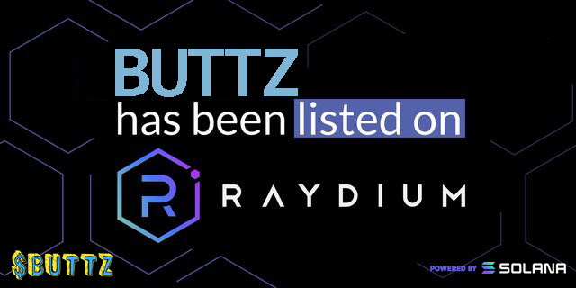

# 📈 How to buy BUTTZ

$BUTTZ is integrated for trading on all major Solana DEX, with the purpose to offer different solutions for liquidity providing or buy/sell/stake/farm the token.

## Swap or place order on Jupiter

#### You can traditional swap or place limit buy/sell orders vs USDC on [**Jupiter Aggregator**](https://jup.ag/swap/USDC-BUTTZ\_ButtzRVXEyHU8oxQmrUEpcTyE7qR9zGtyr43AVkYnuKK) &#x20;

<figure><figcaption></figcaption></figure>

## TRADITIONAL SWAP

&#x20;1 - Visit [https://jup.ag/swap/USDC-BUTTZ\_ButtzRVXEyHU8oxQmrUEpcTyE7qR9zGtyr43AVkYnuKK](https://jup.ag/swap/USDC-BUTTZ\_ButtzRVXEyHU8oxQmrUEpcTyE7qR9zGtyr43AVkYnuKK)\
\

<figure><figcaption></figcaption></figure>

2 - Insert the amount of $USDC you wish to swap for $BUTTZ. The interface autocompile with the amount of $BUTTZ you will receive after swap.

3 - Connect your Phantom (or any other Solana wallet) and proceed to swap.


Changing the base token could result in inefficient swap because of routing through other cryptocurrencies, so we always suggest to swap from USDC.


4 - Once swap is completed, your balance will reflect updated balances for $BUTTZ and $USDC

You can also swap directly from our official website [https://buttz.vercel.app](https://buttz.vercel.app/) using the integrated swap terminal, that works in the same way and use the same Jupiter Aggregator router.

<figure><figcaption></figcaption></figure>

## LIMIT ORDERS

1 - Visit [https://jup.ag/limit/SOL-BUTTZ\_ButtzRVXEyHU8oxQmrUEpcTyE7qR9zGtyr43AVkYnuKK](https://jup.ag/limit/SOL-BUTTZ\_ButtzRVXEyHU8oxQmrUEpcTyE7qR9zGtyr43AVkYnuKK)

<figure><figcaption></figcaption></figure>

2 - Choose the amount of $USDC you want to sell for $BUTTZ

3 - Choose if/when your limit order expiry if not filled.

4-Place your ,limit order and approve transaction to complete. .png>)

5 - Congrats! You placed your limit order on DEX that will exist until filled/expiry.\

## Swap on Raydium

#### You can complete traditional swaps on [Raydium](https://raydium.io/swap?inputCurrency=EPjFWdd5AufqSSqeM2qN1xzybapC8G4wEGGkZwyTDt1v\&outputCurrency=ButtzRVXEyHU8oxQmrUEpcTyE7qR9zGtyr43AVkYnuKK) according to following procedure.

<figure><figcaption></figcaption></figure>

&#x20;1 - Visit [https://raydium.io/swap?inputCurrency=EPjFWdd5AufqSSqeM2qN1xzybapC8G4wEGGkZwyTDt1v\&outputCurrency=ButtzRVXEyHU8oxQmrUEpcTyE7qR9zGtyr43AVkYnuKK](https://raydium.io/swap?inputCurrency=EPjFWdd5AufqSSqeM2qN1xzybapC8G4wEGGkZwyTDt1v\&outputCurrency=ButtzRVXEyHU8oxQmrUEpcTyE7qR9zGtyr43AVkYnuKK)\

<figure><figcaption></figcaption></figure>

2 - Insert the amount of $USDC you wish to swap for $BUTTZ. The interface autocompile with the amount of $BUTTZ you will receive after swap.

3 - Connect your Phantom (or any other Solana wallet) and proceed to swap.


Changing the base token could result in inefficient swap because of routing through other cryptocurrencies, so we always suggest to swap from USDC.


4 - Once swap is completed, your balance will reflect updated balances for $BUTTZ and $USDC.\
