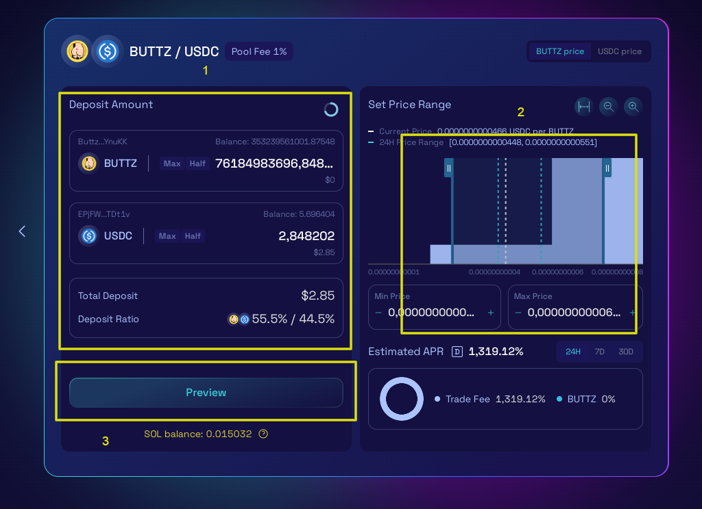
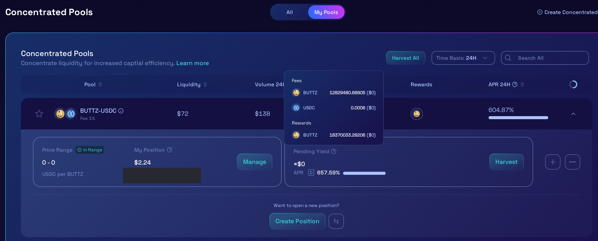

# 🌾 How to farm BUTTZ

## Liquidity farm and pools on Raydium&#x20;

$BUTTZ pool on Raydium use the CLMM mechanism through which is possible to provide and concentrate liquidity in a specific range for increased captial efficiency. \[[Learn more](https://docs.raydium.io/raydium/concentrated-liquidity/what-is-concentrated-liquidity)]

1 - Visit [https://raydium.io/clmm/pools](https://raydium.io/clmm/pools) and look for BUTTZ from the search field in top right.\

<figure><figcaption></figcaption></figure>

Alternatively go on [https://raydium.io/clmm/create-position?ammId=6D9vquHfuzLR1BZtFQ7WFGCyepZCzrGYypbJ8mTpzUNo](https://raydium.io/clmm/create-position?ammId=6D9vquHfuzLR1BZtFQ7WFGCyepZCzrGYypbJ8mTpzUNo) and jump to step 3\
\
\
2 - To open a position click on the dedicated pool and "Create Position"&#x20;

<figure><figcaption></figcaption></figure>

3 - Choose the desired amount of $BUTTZ/$USDC you want to provide as liquidity and use to earn rewards from trades and farming, adjust the range on which you want to porovide luiquidity through bracket (or through windows min/max price), then click on PREVIEW.

<figure><figcaption></figcaption></figure>

3 - Once the resume appear, you can check your position. If you are satisfied, you can proceed with "Confirm Deposit". Confirm the transaction on your wallet to proceed.

<figure><figcaption></figcaption></figure>

4 - Once the transaction is successfully confirmed, you are already farming and earning your passive income through $BUTTZ! You can check your position anytime clicking on the pool.\
A popup will show your updated position, your current APR % and your pending yields.\
Click "Harvest" to receive your collected rewards, click "Manage" to adjust your position or remove your liquidity and close the position partially/totally.\
If you wish to create a new position (while having one already open) for another range of liquidity, click on "Create position"

<figure><figcaption></figcaption></figure>

5 - Clicking on "Manage" will give you a compolete breakdown of your current position.

<figure><figcaption></figcaption></figure>

6 - To close your position click on "Remove liquidity" (from the previous image). A new popup will appear: choose the % of liquidity you want to remove and click "Withdraw".\
After confirming transaction, all your liquidity will be removed and returned to your balance, togheter with all harvested rewards from the farm, and the position will be closed.

<figure><figcaption></figcaption></figure>


Before to provide liquidity, be aware of risks of **impermanent loss**. If you are not familiar with this concept and with risk involved, please read [Raydium official documentation](https://docs.raydium.io/raydium/concentrated-liquidity/providing-concentrated-liquidity) to understand what is the impermanent loss risk and how can affect your investments.



_The team or the platform cannot and will not be liable for any loss resulting from your investments decisions._

