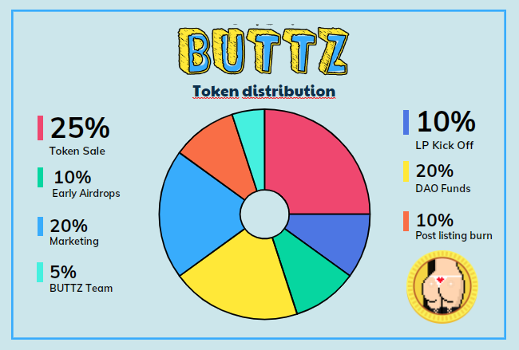

# 💰 Tokenomics and finances

BUTTZ mint happened on January 18, 2023 with 100,000,000,000,000 $BUTTZ tokens created at genesis. \
****

<figure><figcaption></figcaption></figure>

According to the graphic above, 25% of total supply was allocated for a token sale with the purpose of raising initial liquidity. Early contributors subscribed for 11% of the amount allocated, while the remaining 14% where [burned.](https://solscan.io/tx/258DuVyybPWJ7xrFiSnNH9VR9q4urP4b6CMMRQa56rnAynU9EVFyZEuA8qCB5jYRRne3WuT4VjRZo1NE138fQ6VW)\
An additional 10% will be burned recursively and periodically with the purpose of dilute the total supply. A complete breakdown of all burns already done is available **HERE.**\

The amount raised durintg token sale where used to inject liquidity paired with 10% of $BUTTZ allocated, and **LP's tokens** where immediately **** [**burned**](https://solscan.io/tx/56Ug2JT6oJz8p4KnxhCrkoLFikozGbfq48UoXpSQy3RRWx7bNc4wJYv4D92TVBwWCaekALgG13BnUXfijMFG6Z5d) **** after launch, **locking liquidity** and profit from farm **forever.**\
****\
****Remaining allocation will be distributed as following:\
20% for marketing and future airdrops (protocol integrations, additional liquidity provisioning, giveaways).\
20% as reserve for future DAO activity.\
5% is allocated to the team: 6 month cliff with 2 year vesting schedule.\


In case of special events or unexpected situations, the team reserve rights to do budget reallocation without further notice.


### Project  expenses 

Every project need funds successfully develop the planned roadmap. When you choose to support our project you help us to afford paying for expenses that the team sustain to run and successfully develop this project, such as back end, domain, hosting, giveaways, paying artists, developers & mods.&#x20;

**Mandatory expenses**

* Developers.
* Domain, hosting and platform.
* Droplets or backend infrastructure.
* Discord verification services.
* Promotions and partnership

**Optional Expenses**

* NFT services subscription.
* Discord boosts.

**​Potential Expenses:**

* Ambassadors salary
* Discord staff (collab managers, community managers, moderators).
* Future artists collaborations
