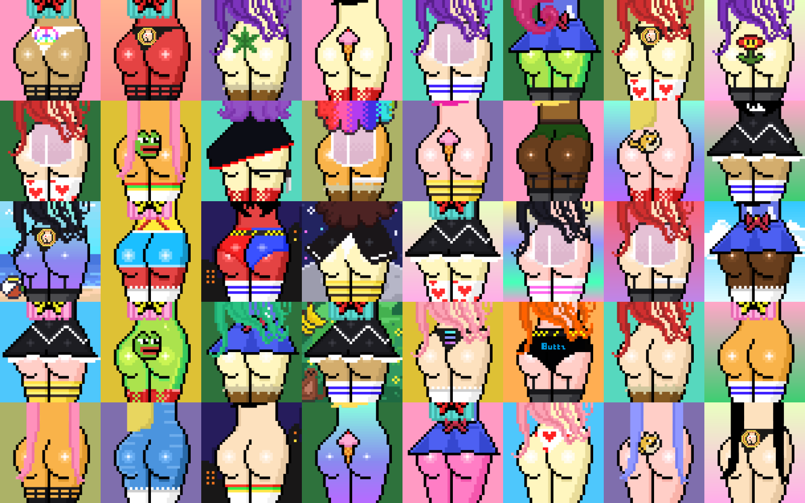

# 🤝 Sol Buttz NFT collection

Sol Buttz is a project based on an NFT collection and powered by a proprietary SPL token that rule the ecosystem.\
The collection is composed by 888 unique pixel art artwork and is designed and created by the visual and pixel artist[ **Daneli.Sol**](https://twitter.com/danelisol).

<figure><figcaption></figcaption></figure>

Each NFT is a one-of-a-kind digital asset with proper traits and rarity that can be owned and traded on the blockchain and has their own story and personality.\
Thanks to his degen concept, the collection aim to become one of the most viral meme on Solana NFT space.\
After mint, **SOL BUTTZ NFT** as digital assets, togheter with $BUTTZ token as digital currency will offer multiple [utilities ](broken-reference)and passive income opportunities (staking and lending to name few) to an always growing community of holders.
